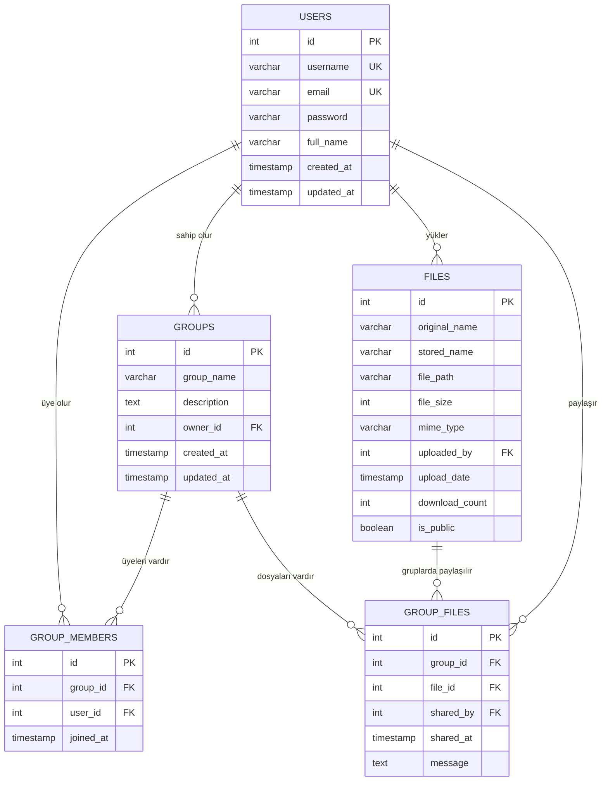

## 📊 Entity-Relationship (ER) Diyagramı



## 🗄️ Veritabanı Tabloları Detayı

### 1. USERS Tablosu
**Amaç:** Sistem kullanıcılarının bilgilerini saklar

| Alan | Tip | Açıklama | Kısıtlamalar |
|------|-----|----------|--------------|
| `id` | INT | Birincil anahtar | AUTO_INCREMENT, PRIMARY KEY |
| `username` | VARCHAR(50) | Kullanıcı adı | NOT NULL, UNIQUE |
| `email` | VARCHAR(100) | E-posta adresi | NOT NULL, UNIQUE |
| `password` | VARCHAR(255) | Şifrelenmiş parola | NOT NULL |
| `full_name` | VARCHAR(100) | Tam ad | NOT NULL |
| `created_at` | TIMESTAMP | Kayıt tarihi | DEFAULT CURRENT_TIMESTAMP |
| `updated_at` | TIMESTAMP | Güncelleme tarihi | DEFAULT CURRENT_TIMESTAMP ON UPDATE CURRENT_TIMESTAMP |

**İndeksler:**
- `idx_users_username` - username alanı için
- `idx_users_email` - email alanı için

### 2. GROUPS Tablosu
**Amaç:** Kullanıcı gruplarının bilgilerini saklar

| Alan | Tip | Açıklama | Kısıtlamalar |
|------|-----|----------|--------------|
| `id` | INT | Birincil anahtar | AUTO_INCREMENT, PRIMARY KEY |
| `group_name` | VARCHAR(100) | Grup adı | NOT NULL |
| `description` | TEXT | Grup açıklaması | NULL |
| `owner_id` | INT | Grup sahibinin ID'si | NOT NULL, FOREIGN KEY → users(id) |
| `created_at` | TIMESTAMP | Oluşturulma tarihi | DEFAULT CURRENT_TIMESTAMP |
| `updated_at` | TIMESTAMP | Güncelleme tarihi | DEFAULT CURRENT_TIMESTAMP ON UPDATE CURRENT_TIMESTAMP |

**İndeksler:**
- `idx_groups_owner` - owner_id alanı için

**Foreign Key Kısıtlamaları:**
- `owner_id` → `users(id)` ON DELETE CASCADE

### 3. GROUP_MEMBERS Tablosu
**Amaç:** Grup üyeliklerini yönetir (Many-to-Many ilişki tablosu)

| Alan | Tip | Açıklama | Kısıtlamalar |
|------|-----|----------|--------------|
| `id` | INT | Birincil anahtar | AUTO_INCREMENT, PRIMARY KEY |
| `group_id` | INT | Grup ID'si | NOT NULL, FOREIGN KEY → groups(id) |
| `user_id` | INT | Kullanıcı ID'si | NOT NULL, FOREIGN KEY → users(id) |
| `joined_at` | TIMESTAMP | Katılma tarihi | DEFAULT CURRENT_TIMESTAMP |

**İndeksler:**
- `idx_group_members_group` - group_id alanı için
- `idx_group_members_user` - user_id alanı için

**Unique Kısıtlamaları:**
- `unique_membership` - (group_id, user_id) kombinasyonu benzersiz olmalı

**Foreign Key Kısıtlamaları:**
- `group_id` → `groups(id)` ON DELETE CASCADE
- `user_id` → `users(id)` ON DELETE CASCADE

### 4. FILES Tablosu
**Amaç:** Yüklenen dosyaların bilgilerini saklar

| Alan | Tip | Açıklama | Kısıtlamalar |
|------|-----|----------|--------------|
| `id` | INT | Birincil anahtar | AUTO_INCREMENT, PRIMARY KEY |
| `original_name` | VARCHAR(255) | Orijinal dosya adı | NOT NULL |
| `stored_name` | VARCHAR(255) | Sunucuda saklanan dosya adı | NOT NULL |
| `file_path` | VARCHAR(500) | Dosya yolu | NOT NULL |
| `file_size` | INT | Dosya boyutu (byte) | NOT NULL |
| `mime_type` | VARCHAR(100) | MIME tipi | NULL |
| `uploaded_by` | INT | Yükleyen kullanıcı ID'si | NOT NULL, FOREIGN KEY → users(id) |
| `upload_date` | TIMESTAMP | Yüklenme tarihi | DEFAULT CURRENT_TIMESTAMP |
| `download_count` | INT | İndirme sayısı | DEFAULT 0 |
| `is_public` | BOOLEAN | Herkese açık mı? | DEFAULT TRUE |

**İndeksler:**
- `idx_files_uploader` - uploaded_by alanı için

**Foreign Key Kısıtlamaları:**
- `uploaded_by` → `users(id)` ON DELETE CASCADE

### 5. GROUP_FILES Tablosu
**Amaç:** Gruplarda paylaşılan dosyaları yönetir

| Alan | Tip | Açıklama | Kısıtlamalar |
|------|-----|----------|--------------|
| `id` | INT | Birincil anahtar | AUTO_INCREMENT, PRIMARY KEY |
| `group_id` | INT | Grup ID'si | NOT NULL, FOREIGN KEY → groups(id) |
| `file_id` | INT | Dosya ID'si | NOT NULL, FOREIGN KEY → files(id) |
| `shared_by` | INT | Paylaşan kullanıcı ID'si | NOT NULL, FOREIGN KEY → users(id) |
| `shared_at` | TIMESTAMP | Paylaşılma tarihi | DEFAULT CURRENT_TIMESTAMP |
| `message` | TEXT | Paylaşım mesajı | NULL |

**İndeksler:**
- `idx_group_files_group` - group_id alanı için

**Foreign Key Kısıtlamaları:**
- `group_id` → `groups(id)` ON DELETE CASCADE
- `file_id` → `files(id)` ON DELETE CASCADE
- `shared_by` → `users(id)` ON DELETE CASCADE

## 🔗 Tablo İlişkileri

### 1. Users ↔ Groups İlişkisi
- **İlişki Tipi:** One-to-Many (1:N)
- **Açıklama:** Bir kullanıcı birden fazla grubun sahibi olabilir
- **Foreign Key:** `groups.owner_id` → `users.id`

### 2. Users ↔ Group_Members İlişkisi
- **İlişki Tipi:** One-to-Many (1:N)
- **Açıklama:** Bir kullanıcı birden fazla grubun üyesi olabilir
- **Foreign Key:** `group_members.user_id` → `users.id`

### 3. Groups ↔ Group_Members İlişkisi
- **İlişki Tipi:** One-to-Many (1:N)
- **Açıklama:** Bir grubun birden fazla üyesi olabilir
- **Foreign Key:** `group_members.group_id` → `groups.id`

### 4. Users ↔ Groups (Many-to-Many)
- **Ara Tablo:** `group_members`
- **Açıklama:** Kullanıcılar ve gruplar arasında çoktan-çoğa ilişki
- **Özel Durum:** Grup sahibi otomatik olarak grup üyesi olur

### 5. Users ↔ Files İlişkisi
- **İlişki Tipi:** One-to-Many (1:N)
- **Açıklama:** Bir kullanıcı birden fazla dosya yükleyebilir
- **Foreign Key:** `files.uploaded_by` → `users.id`

### 6. Groups ↔ Group_Files İlişkisi
- **İlişki Tipi:** One-to-Many (1:N)
- **Açıklama:** Bir grupta birden fazla dosya paylaşılabilir
- **Foreign Key:** `group_files.group_id` → `groups.id`

### 7. Files ↔ Group_Files İlişkisi
- **İlişki Tipi:** One-to-Many (1:N)
- **Açıklama:** Bir dosya birden fazla grupta paylaşılabilir
- **Foreign Key:** `group_files.file_id` → `files.id`

### 8. Users ↔ Group_Files İlişkisi
- **İlişki Tipi:** One-to-Many (1:N)
- **Açıklama:** Bir kullanıcı birden fazla dosyayı gruplarda paylaşabilir
- **Foreign Key:** `group_files.shared_by` → `users.id`

## 🏗️ Proje Mimarisi

### Dizin Yapısı
```
odev/
├── api/                    # API endpoint'leri
│   └── search_users.php   # Kullanıcı arama API'si
├── assets/                # Statik dosyalar
│   ├── css/
│   │   └── style.css     # Ana stil dosyası
│   └── js/
│       └── main.js       # Ana JavaScript dosyası
├── classes/               # PHP sınıfları
│   ├── User.php          # Kullanıcı işlemleri
│   ├── Group.php         # Grup işlemleri
│   └── File.php          # Dosya işlemleri
├── config/                # Konfigürasyon dosyaları
│   ├── database.php      # Veritabanı bağlantısı
│   └── security.php      # Güvenlik ayarları
├── includes/              # Ortak include dosyaları
│   ├── header.php        # Sayfa başlığı
│   ├── footer.php        # Sayfa altlığı
│   └── recent_files.php  # Son dosyalar widget'ı
├── logs/                  # Log dosyaları
├── pages/                 # Sayfa dosyaları
│   ├── login.php         # Giriş sayfası
│   ├── register.php      # Kayıt sayfası
│   ├── upload.php        # Dosya yükleme
│   ├── groups.php        # Grup listesi
│   ├── group_detail.php  # Grup detayı
│   ├── group_manage.php  # Grup yönetimi
│   └── download.php      # Dosya indirme
├── uploads/               # Yüklenen dosyalar
├── database.sql          # Veritabanı şeması
└── index.php             # Ana sayfa
```

### Mimari Katmanları

#### 1. Sunum Katmanı (Presentation Layer)
- **Dosyalar:** `pages/*.php`, `index.php`, `includes/*.php`
- **Sorumluluk:** Kullanıcı arayüzü ve HTTP isteklerini yönetme
- **Teknolojiler:** HTML, CSS, JavaScript, PHP

#### 2. İş Mantığı Katmanı (Business Logic Layer)
- **Dosyalar:** `classes/*.php`
- **Sorumluluk:** İş kuralları ve uygulama mantığı
- **Sınıflar:**
  - `User`: Kullanıcı yönetimi (kayıt, giriş, arama)
  - `Group`: Grup yönetimi (oluşturma, üye ekleme/çıkarma)
  - `File`: Dosya yönetimi (yükleme, indirme, silme)

#### 3. Veri Erişim Katmanı (Data Access Layer)
- **Dosyalar:** `config/database.php`
- **Sorumluluk:** Veritabanı bağlantısı ve veri işlemleri
- **Teknoloji:** PDO (PHP Data Objects)

#### 4. API Katmanı
- **Dosyalar:** `api/*.php`
- **Sorumluluk:** RESTful API endpoint'leri
- **Format:** JSON

## 🔌 API Endpoint'leri

### 1. Kullanıcı Arama API
**Endpoint:** `GET /api/search_users.php`

**Parametreler:**
- `q` (string, required): Arama terimi (minimum 2 karakter)

**Yanıt:**
```json
[
    {
        "id": 1,
        "username": "johndoe",
        "full_name": "John Doe"
    }
]
```

**Hata Durumları:**
- `401 Unauthorized`: Giriş yapılmamış
- `200 OK`: Boş array (arama terimi yetersiz)

## 🛠️ Kurulum ve Kullanım Kılavuzu

### Sistem Gereksinimleri
- PHP 7.4 veya üzeri
- MySQL 5.7 veya üzeri
- Apache/Nginx web sunucusu
- PDO MySQL extension

### Kurulum Adımları

#### 1. Dosyaları Kopyalama
```bash
# Projeyi web sunucusu dizinine kopyalayın
cp -r odev/ /var/www/html/
```

#### 2. Veritabanı Kurulumu
```sql
-- MySQL'e bağlanın ve veritabanını oluşturun
mysql -u root -p

-- database.sql dosyasını çalıştırın
source /path/to/database.sql
```

#### 3. Veritabanı Konfigürasyonu
[`config/database.php`](config/database.php) dosyasını düzenleyin:

```php
private $host = 'localhost';        // Veritabanı sunucusu
private $db_name = 'file_sharing_site'; // Veritabanı adı
private $username = 'root';         // Kullanıcı adı
private $password = '';             // Şifre
```

#### 4. Dizin İzinleri
```bash
# Upload dizinine yazma izni verin
chmod 755 uploads/
chmod 755 logs/

# .htaccess dosyalarının çalıştığından emin olun
```

#### 5. Web Sunucusu Konfigürasyonu
Apache için `.htaccess` dosyaları zaten mevcut. Nginx için:

```nginx
location /uploads/ {
    deny all;
    return 403;
}

location /logs/ {
    deny all;
    return 403;
}

location /config/ {
    deny all;
    return 403;
}
```

### İlk Kullanım

#### 1. Admin Hesabı
Varsayılan admin hesabı:
- **Kullanıcı adı:** admin
- **E-posta:** admin@example.com
- **Şifre:** password (hash'lenmiş hali veritabanında)

#### 2. Yeni Kullanıcı Kaydı
1. [`pages/register.php`](pages/register.php) sayfasına gidin
2. Gerekli bilgileri doldurun
3. Kayıt olun

#### 3. Dosya Yükleme
1. Giriş yapın
2. "Dosya Yükle" butonuna tıklayın
3. Dosyayı seçin ve yükleyin

#### 4. Grup Oluşturma
1. "Takımlarım" sayfasına gidin
2. "Yeni Grup Oluştur" butonuna tıklayın
3. Grup bilgilerini doldurun

## 🔒 Güvenlik Özellikleri

### 1. Kimlik Doğrulama
- Şifreler `password_hash()` ile hash'lenir
- Session tabanlı kimlik doğrulama
- Otomatik oturum sonlandırma

### 2. Dosya Güvenliği
- İzin verilen dosya türleri kısıtlı
- Dosya boyutu limiti (10MB)
- Güvenli dosya adlandırma (uniqid)
- Upload dizini web erişiminden korunmuş

### 3. SQL Injection Koruması
- Prepared statements kullanımı
- PDO ile parameterized queries

### 4. XSS Koruması
- `htmlspecialchars()` ile output encoding
- Input validation

### 5. CSRF Koruması
- Session tabanlı doğrulama
- Form token'ları (geliştirilmesi önerilen)

## 📊 Performans Optimizasyonları

### 1. Veritabanı İndeksleri
- Sık kullanılan alanlarda indeksler
- Foreign key'lerde otomatik indeksler
- Composite indeksler (group_members tablosunda)

### 2. Dosya Yönetimi
- Fiziksel dosya silme optimizasyonu
- Grup paylaşımı kontrolü
- Dosya boyutu ve tip validasyonu

### 3. Query Optimizasyonları
- JOIN kullanımı ile ilişkili veri çekme
- COUNT() sorguları ile istatistikler
- LIMIT kullanımı ile sayfalama

## 🚀 Gelecek Geliştirmeler

### 1. Önerilen Özellikler
- [ ] Dosya versiyonlama
- [ ] Dosya önizleme
- [ ] Toplu dosya işlemleri
- [ ] Gelişmiş arama filtreleri
- [ ] Dosya etiketleme sistemi
- [ ] Kullanıcı rolleri ve izinleri

### 2. Teknik İyileştirmeler
- [ ] CSRF token sistemi
- [ ] Rate limiting
- [ ] Dosya şifreleme
- [ ] CDN entegrasyonu
- [ ] Mikroservis mimarisi
- [ ] API authentication (JWT)

### 3. UI/UX İyileştirmeleri
- [ ] Responsive tasarım
- [ ] Dark mode
- [ ] Drag & drop dosya yükleme
- [ ] Progress bar'lar
- [ ] Real-time bildirimler

## 📝 Notlar

### Önemli Dosyalar
- [`database.sql`](database.sql): Veritabanı şeması ve test verisi
- [`config/database.php`](config/database.php): Veritabanı bağlantı ayarları
- [`classes/`](classes/): Ana iş mantığı sınıfları
- [`.htaccess`](config/.htaccess): Güvenlik konfigürasyonları

### Geliştirici Notları
- Tüm PHP dosyaları UTF-8 encoding kullanır
- Veritabanı charset: utf8mb4_unicode_ci
- Session timeout: PHP varsayılan ayarları
- Error reporting: Production'da kapatılmalı

### Bakım ve Monitoring
- Log dosyaları [`logs/`](logs/) dizininde
- Upload dosyaları [`uploads/`](uploads/) dizininde
- Düzenli veritabanı backup'ı önerilir
- Disk alanı monitoring gerekli